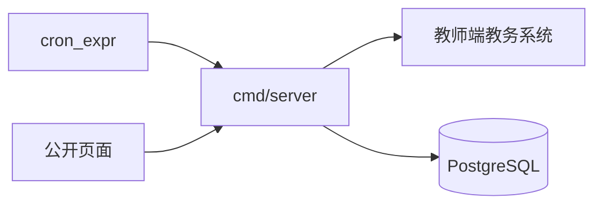

# 采集器全量同步

Feature Name: collector-full-sync
Updated: 2026-10-09

## Description

采集器在本机登录教师端，生成当前学期周历，按白名单教学楼拉取第 1 周到最后一周的状态矩阵，再对聚合矩阵上的有内容格子各取一次占用明细。完成后单事务发布。查询服务不参与上游请求。

依据：

- `docs/decisions/2026-10-09-keep-teacher-status-api.md`
- `docs/decisions/2026-10-09-saturday-full-sync.md`
- `docs/decisions/2026-10-09-term-week-from-one-sample.md`
- `docs/product-requirements.md` 第 3 章

## Architecture



常驻入口只有 `cmd/server`：它听公开查询，并在同一进程里按 `cron_expr` 跑采集。见 `docs/decisions/2026-10-09-single-process-entry.md`。公开查询处理函数不登录教务。`cmd/migrate` 仍单独跑一次。手动同步以后由这个进程里的采集模块执行，不另起进程，也不挂到公开查询路由。

一轮的顺序固定为：登录、读学期、采样周历、按楼拉各周矩阵、按楼拉聚合矩阵、下钻有内容格子、校验、发布。前一步失败且该失败被定为整轮失败时，后面的步骤不开始。

## Components and Interfaces

| 组件 | 职责 |
|---|---|
| `cmd/server` | 唯一常驻入口。听公开查询，并按 `cron_expr` 在同一进程里跑采集。 |
| `internal/collect/login` | CAS 登录与 ddddocr。会话失效时重新登录。目前仍是未实现入口。 |
| `internal/collect/calendar` | 请求周历页，解析周次文本，生成 `term_week`。 |
| `internal/collect/fetch` | 按 `jxlbh` 请求周矩阵、聚合矩阵和占用明细。相邻请求间隔至少 500 毫秒，单次最多 3 次重试。 |
| `internal/collect/clean` | 沿用 `docs/contract/data-format.v2.md` 的解析、房名规范、状态分类和 12 小节展开。 |
| `internal/collect/sync` | 任务状态机。任务完成后不重打。 |
| `internal/collect/publish` | 校验通过后单事务切换 current / previous。 |

面板的登录、白名单编辑页和进度页属于阶段 3。本功能先提供采集器读取的配置和进度表，管理接口可以后接。手动开始在阶段 3 落地前不暴露成产品入口，也不挂到公开查询路由。

## Data Models

已有 `collect_run`、`collect_run_week`、`alert_log` 继续使用。新增迁移使用 `0004` 起的编号，不改 `0001_init.sql`。

`room` 增加：

- `building_id`：返回该房间的 `jxlbh`
- `building_name`：该次采集的教学楼展示名

`settings` 使用已有键 `building_whitelist`。值是 JSON 数组，元素为 `jxlbh` 与 `name`。

新增 `sync_task`：

- `run_id`
- `kind`：`week_matrix` 或 `cell_detail`
- `building_id`
- `week`：明细任务为空
- `room_id`、`weekday`、`block`：只用于明细任务
- `status`：`pending`、`done`、`failed`
- `attempt_count`
- `error_message`

新增 `occupancy_detail`：

- `release_id`
- `room_id`
- `weekday`
- `block`
- `state_key`
- `course`
- `week_range`
- `time_flag`
- `derived`

申请人、任课教师和原始 HTML 不进入这张表。`course` 同时承载课程名和出现在课程字段中的考试科目。

周历生成：

```text
采样日所在周的周一 = 采样日期 - (星期几 - 1) 天
第 1 周周一 = 该周一 - (周次 - 1) × 7 天
第 n 周周一 = 第 1 周周一 + (n - 1) × 7 天
```

星期几由采样日期计算，周一为 1，周日为 7。教学周按连续的周一到周日处理。

## Correctness Properties

- 查询服务把 `date_offset` 换成日期后，只通过 `term_week` 得到周次。采集器是周历的唯一写入者。
- 某周存在周矩阵时，该周是否空闲只由该矩阵决定。明细的周次范围只填没有矩阵的周，并带 `derived=true`。
- 周次范围解析失败的周保持未知，未知不可用。
- 同一 `jsbh` 在一轮中只归属一栋楼。
- 白名单为空时没有上游业务请求。
- `running` 与 `blocked` 不把查询侧新鲜度判成采集失败。只有 `failed` 才算失败。
- 任一周距最近成功超过 8 天为过期。过期仍返回已发布数据。

## Error Handling

| 条件 | 处理 |
|---|---|
| 登录页或非法访问 | 重新登录后续跑。已完成任务保留。 |
| 周次文本无法解析 | 整轮 `failed`，不写半截周历，不发布。 |
| 白名单为空 | `blocked`，不请求教室状态。 |
| 单个周矩阵或明细重试耗尽 | 该任务 `failed`，其余任务继续。 |
| 表头块集合变化 | 整轮停止，告警，不发布。 |
| 同一 `jsbh` 出现在两栋楼 | 整轮 `failed`，不发布。 |
| 发布事务失败 | current 保持原样。 |

告警沿用现有去重：重试耗尽后的最终失败、校验拦截、学期切换、连续失败后的首次恢复各通知一次。告警不含账号、Cookie、验证码和原始页面。

## Test Strategy

- 周历推算用固定日期表：`2026-10-30`、星期五、第 6 周、共 16 周，得到第 1 周周一 `2026-09-21`。覆盖 X 大于 Y、缺少周次文本。
- 状态分类和 12 小节展开沿用契约样例，不依赖真实教务响应。真实 HTML 样本放在测试夹具目录之外，不进 git。
- 任务状态机用内存或事务回滚测试：完成任务不重打，会话失效后续跑，第二轮在 `running` 时被拒绝。
- 重复 `jsbh`、空白名单、表头块变化各有一个失败测试，并断言 current 不变。
- 查询侧只增加周历读取和 8 天新鲜度的回归。不把采集器测试放进会写外部库的默认 `go test`，除非该测试自己起事务并回滚。

## References

[^1]: (Filename) - [一次采样生成周历](docs/decisions/2026-10-09-term-week-from-one-sample.md)
[^2]: (Filename) - [周六全量同步](docs/decisions/2026-10-09-saturday-full-sync.md)
[^3]: (Filename) - [教学楼白名单](docs/decisions/2026-10-09-keep-teacher-status-api.md)
